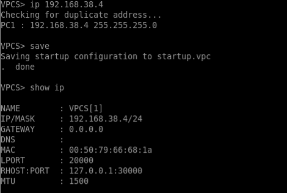

# Redes de Computadoras 1

  ## Práctica 1
  

   
:pencil:  Autores: Rosa Emilia Boche Naz - 200915633
:pencil:     Alberto Gabriel Reyes Ning - 201612174

 ## INTRODUCCIÓN 
  En la era moderna las redes de comunicación desempeñan un pape fundamental para la transferencia de información. Al momento de enviar un mensaje de cualquier tipo, ya se multimedia, texto plano o simplemente caracteres, estos son transformados en paquetes para generar un trafico mas eficiente.
  Analizar y monitoriar estos paquetes es esencial para mantener y mejorar el rendimiento y seguridad de la red.

##OBJETIVOS

Con el uso de la herramiente Wireshark comprender la estructura de los paquetes, su encabezados y campos que los conforman para garantizar una entrega eficiente.

##ALCANCE
Con las herramientas Wireshark y PnetLab se aprendera a capturar y analizar los paquetes que se encuentran en una red de computadoras.

# CONTENIDO DE PRACTICA 1
  ## TABLA DE IP
   

| Nivel    | area |Identificador| IP    |MARCARA SUBRED
|:--------:|:----:|:---------:|:-----:|:--------|
| Nivel 1   | Almacenamiento |ST-1001  |192.168.38.1     |255.255.255.0
|           | Almacenamiento |ST-1002  |192.168.38.2     |255.255.255.0
|           | Recepcipción   |RE-1001| 192.168.38.3     |255.255.255.0
|           | Recepción   |RE-2001|192.168.38.4    |255.255.255.0
| Nivel 2  | Oficina Administrativa   |OA-2001|192.168.38.5  |255.255.255.0
|           |Oficina Administrativa   |OA-2002|192.168.38.6   |255.255.255.0
|           | Oficina Administrativa  |OA-2003|192.168.38.7  |255.255.255.0
|           | Servicio al Cliente |SA-2001|192.168.38.8    |255.255.255.0
|           | Servicio al Cliente |SA-2002|192.168.38.9    |255.255.255.0
|           | Servicio al Cliente |SA-2003|192.168.38.10   |255.255.255.0
|           | Servicio al Cliente |SA-2004|192.168.38.11  |255.255.255.0
| Nivel 3 | Gerencia  |GE-3001|192.168.38.12   |255.255.255.0
|          | Gerencia  |GE-3002|192.168.38.13  |255.255.255.0
|          | Operaciones   |OP-3001|192.168.38.14  |255.255.255.0
|          | Operaciones   |OP-3002|192.168.38.15  |255.255.255.0
|          | Operaciones   |OP-3003|192.168.38.16  |255.255.255.0

#HARDWARE  NECESARIO PARA IMPLEMENTAR LA PRÁCTICA

## EQUIPO ADMINISTRABLE

* Se querira tres Switches  uno para cada nivel
  *Existen diferente modelos que se pueden adaptar sin embargo tomando en cuenta el costo y el rendiminto se sugiere:

    ° Tres Switch Cisco SG110D-08 GIGABIT   
    CARACTERISTICAS
        :pushpin: Marca Cisco
        :pushpin: 8 puertos
        :pushpin:Dispositivos compartibles: Desktop
        :pushpin:10,24 x 6,69 x 1,97 pulgadas
        :pushpin: voltaje : 12 volts
        :pushpin: precio US \$434.97 , US\$144.99 por unidad 
        :pencil: NOTA: Se debe tomar en cuenta la toma de corriente y adaptador debido a que esta diseñado para uso en EEUU
* Patch Panel
  Para una mayor organización se requiere el uso de tres  patch panel
  CARACTERISTICAS
  :pushpin: precio \$48.57 , \$16.19 cada uno

* Equipos para el usuarios finales 
  Se suguiere 16 Laptos del modelo que se adapte  mejor al presuesto y requerimiento del los usuarios 
  :pushpin: voltaje en promedio 35 volts
      
* UPS PARA UN TIEMPO DE 30 MINUTOS
° En el primer nivel con cuatro equipos y un switch se necesitara un 
-Carga total = (Consumo de los 4 equipos) + (Consumo del switch)
Carga total = (4 * 35 W) + 12 W
Carga total = 148 W
Energía requerida = Carga total * Tiempo de respaldo en horas
Energía requerida = 148 W * (30 min / 60) h
Energía requerida = 74 Wh
° Segundo nivel con 7 equipos y 1 Switch
  Carga total de los equipos = 35 W * 7 equipos
Carga total de los equipos = 245 W
Carga total = 245 W + 12 W
Carga total = 257 W
Energía requerida = 257 W * 0.5 h
Energía requerida = 128.5 Wh
°En el tercer nivel con 5 equipos y un switch
Carga total de los equipos = 35 W * 5 equipos
Carga total de los equipos = 175 W
Carga total = 175 W + 12 W
Carga total = 187 W
.Energía requerida = 187 W * 0.5 h
Energía requerida = 93.5 Wh

 :pencil: Se recomiendo tres UPS uno para cada nivel
 marca APC BX850M-LM60 
Unidad Back UPS Pro BX 850 VA
:pushpin: 8 tomas de salida
:pushpin: AVR
:pushpin: interfaz LCD
:pushpin: precio \$ 8,787 ,  \$2,929.00 cada uno
#CONFIGURACION
## ASIGNANDO LAS IP A CADA EQUIPO
  Ingresando  a  la terminal de cada uno de las VPC
  :pushpin: asignando las nuevas ip : ip 192.168.38.xx
  :pushpin: guardando cambios: save
### comandos en terminal

### nivel 1

### nivel 2

### nivel 3

