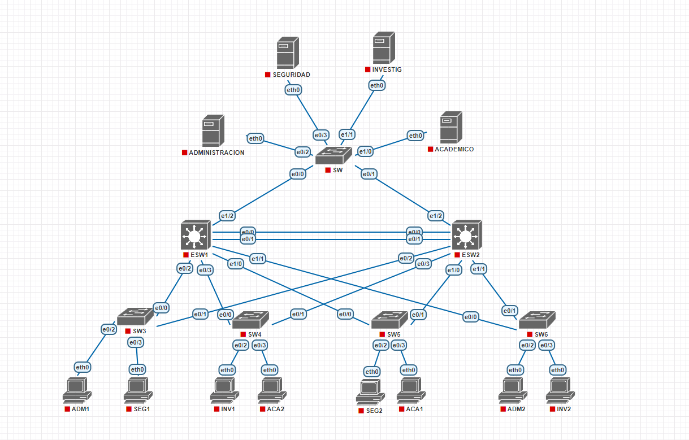
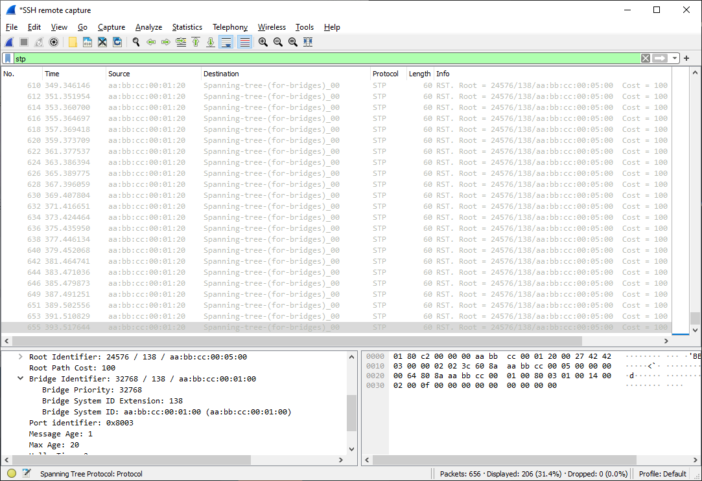

#Redes de Computadoras 1

 ## Manual Proyecto 1

 Autores:  
  :pencil: Rosa Emilia Boche Naz - 200915633  
:pencil:    Alberto Gabriel Reyes Ning - 201612174  

 ## INTRODUCCIÓN 
  En la era moderna las redes de comunicación desempeñan un papel fundamental para la transferencia de información. Al momento de enviar un mensaje de cualquier tipo, ya se multimedia, texto plano o simplemente caracteres, estos son transformados en paquetes para generar un trafico mas eficiente.
  Analizar y monitoriar estos paquetes es esencial para mantener y mejorar el rendimiento y seguridad de la red.

    
## OBJETIVOS

Creación de redes de computadoras pequeñas, configuración de VLAN y utilización de protocolos VTP. Además de utilizar las herramientas PNETLab y Wireshark.

#  CONTENIDO DE PROYECTO 1
  
  ## TABLAS DE CONFIGURACIÓN 

 | VLAN |DEPARTAMENTO   |ID DE LA RED|
|---|---|---|
| 138  |  Administración  |172.16.39.0/24   
| 238  |  Control Académico |172.16.40.0/24  
| 338  |  Centro de Investigaciones  |172.16.41.0/24    
| 438  |  Seguridad  |172.16.42.0/24    
|99  | Nativa  | --------  
|999  | Blackhole  | --------    

### Topologia de la red  

  

  

# Configuraciones  
##  ESW1, SW5 Y SW

  ### ESW1  

En la terminal:
1. conf t
2. spanning-tree vlan 1   
3. spanning-tree mode rapid-pvst
4. spanning-tree vlan 1 root primary
5. do show spanning-tree

  ### ESW2 y las demas SW

En la terminal:
> * 1. conf t
> * 2. spanning-tree vlan 1   
> * 3. spanning-tree mode rapid-pvst
> * 4. do show spanning-tree

### Asignacion de VLAN en ESW1

> * vlan 138
> * name Administracion
> * vlan 238
> * name Academico
> * vlan 338
> * name Investig
> * vlan 438
> * name Seguridad
> * vlan 99
> * name Nativa
> * vlan 999
> * name Blackhole
> * end
  
  ### Configuración de Interfaz y modo trunk
> * conf t
> * do show vlan
> * interface range e0/0-3
> * switchport trunk encapsulation dot1q
> * switchport mode trunk
> * interface range e1/0-2
> * switchport trunk encapsulation dot1q
> * switchport mode trunk
> * end
 ### Configuración modo Server y asignación de dominio y contraseña
> * conf t
> * do show interfaces trunk
> * vtp version 2
> * vtp mode server
> * vtp domain pareja38
> * vtp password usac
> * do write
> * do show vtp status
 
 ### Configuración ESW2

> * conf t
> * interface range e0/0-3
> * switchport trunk encapsulation dot1q
> * switchport mode trunk
> * interface range e1/0-2
> * switchport trunk encapsulation dot1q
> * switchport mode trunk
> * vtp version 2
> * vtp mode client
> * vtp domain pareja38
> * vtp password usac
> * vtp mode transparent
> * do write
> * do show vtp status
 ### Configuración de SW, SW3-6

> * conf t
> * interface range e0/0-1
> * switchport trunk encapsulation dot1q
> * switchport mode trunk
> * vtp version 2
> * vtp mode client
> * vtp domain pareja38
> * vtp password usac
> * do write
> * do show vtp status
> * interface e0/2
> * switchport mode access
> * switchport access vlan 138
> * 
> * interface e0/3
> * switchport mode access
> * switchport access vlan 438
> * 
> * interface e1/0
> * switchport mode access
> * switchport access vlan 238
> * 
> * interface e1/1
> * switchport mode access
> * switchport access vlan 338
> * 
> * interface range e1/2-3
> * switchport mode access
> * switchport access vlan 999
> * do write
> * 
> * interfaces range e0/0-1
> * switchport trunk native vlan 99
> * do write

### Configuración de ESW1
 
> * conf t
> * interfaces range e0/0-3
> * switchport trunk native vlan 99
> * interfaces range e1/0-2
> * switchport trunk native vlan 99
> * do write
> * spanning-tree vlan 99,138,238,338,438,999 root primary

 

### Configuración de ESW2

> * conf t
> * interfaces range e0/0-3
> * switchport trunk native vlan 99
> * interfaces range e1/0-2
> * switchport trunk native vlan 99
> * do write
> * do show interfaces trunk
> * do show spanning-tree
 
### Configuración de SW y SW3-6
 
> * conf t
> * vtp version 2
> * vtp mode client
> * vtp domain pareja38
> * vtp password usac
> * do write
> * interface range e0/0-1
> * switchport trunk encapsulation dot1q
> * switchport mode trunk
> * switchport trunk native vlan 99
> * do write
> * interface e0/2
> * switchport mode access
> * switchport access vlan <vlan>
> * interface e0/3
> * switchport mode access
> * switchport access vlan <vlan>
> * do write
> * do show interfaces trunk
> * do show spanning-tree
> * do show vlan

 

## CAPTURAS DE WIRESHARK

#### Administración 
 

#### Seguridad
 

#### Investigación
 

# PRESUPUESTO

## Switch capa 3
### modelo Catalis 3550

> 2 switch cisco 3550 de 48 puertos
- precio unidad $85 unidad
-total 170 dolares

### switch capa 2
> * 5 switch Cisco Catalyst 2960-C and 3560-C Series Compact
Switches
>* $799 cada uno
>* total $3,995

### Cuatro servidores Servidor DELL PowerEdge T30 Xeon
> * Precio unidad $999
> * Total $3,996

### PC
> * 8 PC 
>* precio unidad $672
>* total $5376

### Cables
  #### Cables de Red CAT5E
  > * Para toma de red en los puntos de red de las PC
   se necesitara 8 $ 3.58 cada uno
   >* total $28.71
  #### Para interconexiones
  > * Cable UTP Categoria 5e 305 Metros de 305 m   $ 45 
  dependera del tamaño fisico del establecimiento
