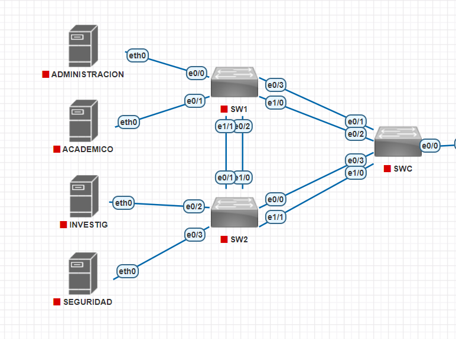
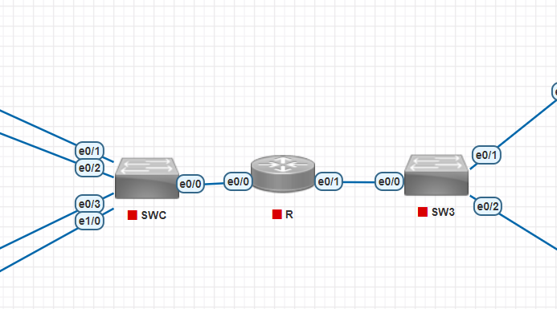
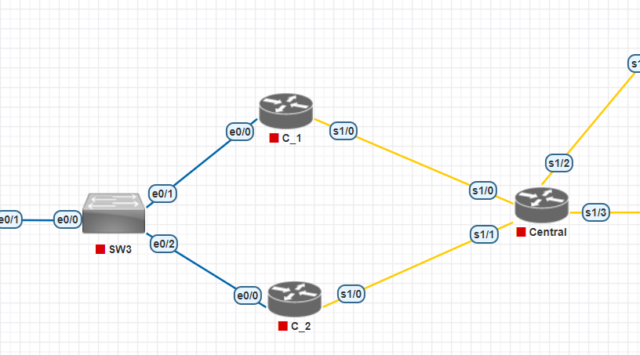
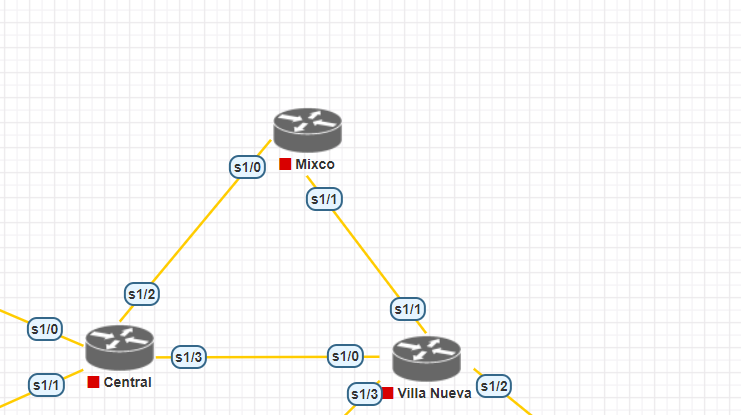
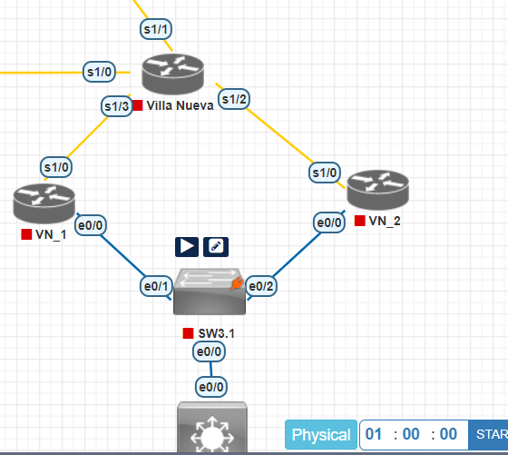


# Redes de Computadoras 1

 ## Manual Proyecto 2

 Autores:  
  :pencil: Rosa Emilia Boche Naz - 200915633  
:pencil:    Alberto Gabriel Reyes Ning - 201612174  

 ## INTRODUCCIÓN 
En el ámbito de la educación, la puesta en práctica del conocimiento adquirido desempeña un papel fundamental en la consolidación y comprensión de conceptos teóricos. En este contexto, el presente desafío invita al estudiante a fusionar teoría y práctica, creando una topología que sirva como campo de pruebas para demostrar el dominio alcanzado hasta el momento.

Con el propósito de aplicar de manera integral los conocimientos obtenidos, se ha planteado la tarea de concebir una topología que refleje las enseñanzas extraídas del proyecto 1 y de las prácticas 1 y 2

    
## OBJETIVOS

Implementar un enrutamiento efectivo entre VLANs utilizando la técnica de "Router on a stick" y configurar interfaces virtuales para garantizar la conectividad entre redes virtuales.

 

#  CONTENIDO DE PROYECTO 

  ## TABLAS DE DIRECCIÓN 

 | **CENTRAL** |ID |EQUIPOS |MASCARA | WILDCARD|ID DE RED| PRIMERA IP| ULTIMA IP| BROADCAST
|--|--|--|--|--|--|--|--|--
|ACADEMICO |18|21|/27 224|0.0.0.31|172.138.2.0|172.18.2.1|172.138.2.30|172.138.2.31
|INVESTIGACION   |  28| 12|/28 240|0.0.0.15|172.138.2.32|172.18.2.33|172.138.2.46|172.138.2.47
| ADMINISTRACION  | 38 | 9|/28	240|0.0.0.15| 172.138.2.48| 172.138.2.49|172.138.2.62|172.138.2.63|
| SEGURIDAD|  48 | 4|  /29 248| 0.0.0.7|172.138.2.64|172.138.2.65|172.138.2.70|172.138.2.71

|**VILLA NUEVA**|ID|Equipos|Mascara|WildCard|ID de red|Primera IP|Ultima IP|Broadcast
|--|--|--|--|--|--|--|--|--
|Academico			|38	|18		|/27	|224	|0.0.0.31	|	173.138.2.0		|173.138.2.1	|	173.138.2.30	|173.138.2.31|
|Seguridad			|28	|12		|/28 |240	|0.0.0.15 		|173.138.2.32	|173.138.2.33	|173.138.2.46|	173.138.2.47|
|Investigacion		|58	|7		|/29	|248	|0.0.0.7	|		173.138.2.48	|173.138.2.49|	173.138.2.54|	173.138.2.55|
|Administracion		|18	|3		|/30	|252	|0.0.0.3	|		173.138.2.56	|173.138.2.57	|173.138.2.58	|173.138.2.59|
 
|VPC|IP|
|--|--|
|ACADEMICO |172.138.2.2|
|INVESTIGACION  |172.18.2.34|
| ADMINISTRACION | 172.138.2.50|
| SEGURIDAD|  172.138.2.66|
|ACA_1 |173.138.2.2|
| SEGU_1|  173.138.2.34|
|INVES_1  |173.18.2.50|
| ADMIN_1 | 173.138.2.58|

 ## RESUMEN DE IP UTILIZADAS
 
| VLAN |Dirección de red|Máscara de subred|Rango de IP asignado|Puerta de enlace predeterminada  
|--|--|--|--|--
 |**Central**	|172.138.2.0	|255.255.255.0|	172.138.2.0 - 172.138.2.255|	N/A (Red principal)|
|Académico|	172.138.2.0	|255.255.255.224|	172.138.2.1 - 172.138.2.30|	172.138.2.1|
|Investiga|172.138.2.32	|255.255.255.240|	172.138.2.33 - 172.138.2.46	|172.138.2.33|
|Administración	|172.138.2.48	|255.255.255.240|	172.138.2.49 - 172.138.2.62	|172.138.2.49|
|Seguridad|	172.138.2.64|	255.255.255.248	|172.138.2.65 - 172.138.2.70	|172.138.2.65|
|R1	|172.138.1.0	|255.255.255.0	|172.138.1.1 - 172.138.1.255	|N/A (Interfaz R1)|
|R1	|172.138.0.0	|255.255.255.248	|172.138.0.1 - 172.138.0.7	|N/A (Virtual en R1)|
|C_1	|172.138.0.0	|255.255.255.248|	172.138.0.1 - 172.138.0.7	|172.138.0.1|
|C_2	|172.138.0.0|	255.255.255.248|	172.138.0.1 - 172.138.0.7	|172.138.0.1|
|Administración (VPCS)|	172.138.2.48|255.255.255.252|172.138.2.49 - 172.138.2.62	|172.138.2.49|
|Seguridad (VPCS)|	172.138.2.64	|255.255.255.248	|172.138.2.65 - 172.138.2.70|	172.138.2.65|
|Académico (VPCS)	|172.138.2.0|	255.255.255.224|	172.138.2.1 - 172.138.2.30	|172.138.2.1|
|Investigación (VPCS)	|172.138.2.32|	255.255.255.240|	172.138.2.33 - 172.138.2.46	|172.138.2.33|
||
|**Villa Nueva**| 173.138.2.0| 255.255.255.0| 173.138.2.0 - 173.138.2.255| N/A (Red Principal)
|Académico|173.138.2.0|255.255.255.224|173.138.2.1 - 173.138.2.30|173.138.2.1|
|Seguridad|173.138.2.32|255.255.255.240|173.138.2.33 - 173.138.2.46|173.138.2.33|
|Investiga|173.138.2.48|255.255.255.240|173.138.2.49 - 173.138.2.54|173.138.2.47|
|Administración|173.138.2.56|255.255.255.248|173.138.2.65 - 173.138.2.58|173.138.2.55|
|ACA_1 (VPCS)|173.138.2.2|255.255.255.224|173.138.2.1 - 173.138.2.30|173.138.2.1|
|SEGU_1 (VPCS)|173.138.2.34|255.255.255.240|173.138.2.33 - 173.138.2.46|173.138.2.33|
|ADMIN_1 (VPCS)	|173.138.2.58|255.255.255.252|172.138.2.49 - 172.138.2.62|173.138.2.57|
|INVES_1 (VPCS)	|173.138.2.50|255.255.255.248|172.138.2.33 - 172.138.2.46|173.138.2.49|

## CALCULOS PARA VLSM PARA CENTRAL

 - **Identificación de requerimientos de direcciones por VLAN:**

	-   **Académico:** 21 equipos.
	-   **Investigación:** 12 equipos.
	-  	**Administración:** 9 equipos.
	-  	**Seguridad:** 4 equipos
 - Calculo  de subredes con VLSM
 -  **	Academico
	 >- Se necesitan 21 direcciones
	 >- 2 exp(5) = 32 direcciones 
	 > - menos 2 , 1 la red y 2 el broadcast
	 >- Mascara/27 
	 >- 30 direcciones
	 
 -  **	Investigacion/Administracion
	 >- Se necesitan 12/9 direcciones
	 >- Mascara/28  - (2 direcciones)
	 >- 14 direcciones
	 
  -  **	Seguridad
	 >- Se necesitan 4 direcciones
	 >- Mascara/29 - (2 direcciones)
	 >- 6 direcciones
-Asignación de subredes
> - **Academico: subred 172.138.2.0/27, con direcciones desde 172.138.2.1 a 172.138.2.30 y un broadcast de    172.138.2.31
>- ** Investigacion: subred 172.138.2.32/28, con direcciones desde 172.138.2.33 a 172.138.2.46 y un broadcast de 172.138.2.47
> - ** Adminitracion: subred 172.138.2.48/28, con direcciones desde 172.138.2.49 a 172.138.2.62 y un broadcast de 172.138.2.63.
> - ** Seguridad: subred 172.138.2.64/29, con direcciones desde 172.138.2.65 a 172.138.2.70 y un broadcast de 172.138.2.71.
>            

## CALCULOS PARA VLSM PARA VILLA NUEVA

 - **Identificación de requerimientos de direcciones por VLAN:**

	-   **Académico:** 18 equipos.
	-   **Investigación:** 7 equipos.
	-  	**Administración:** 3 equipos.
	-  	**Seguridad:** 12 equipos.
 - Calculo  de subredes con VLSM
 -  **	Academico
	 >- Se necesitan 18 direcciones
	 >- 2 exp(5) = 32 direcciones 
	 > - menos 2 , 1 la red y 2 el broadcast
	 >- Mascara/27 
	 >- 30 direcciones

	**	Administracion
	 >- Se necesitan 3 direcciones
	 >- Mascara/30  - (2 direcciones)
	 >- 2 direcciones

 -  **	Investigacion
	 >- Se necesitan 7 direcciones
	 >- Mascara/29  - (2 direcciones)
	 >- 6 direcciones
	 
  -  **	Seguridad
	 >- Se necesitan 12 direcciones
	 >- Mascara/28 - (2 direcciones)
	 >- 14 direcciones
-Asignación de subredes
> - ** Academico: subred 173.138.2.0/27, con direcciones desde 172.138.2.1 a 172.138.2.30 y un broadcast de    172.138.2.31
> - ** Seguridad: subred 172.138.2.32/29, con direcciones desde 172.138.2.33 a 172.138.2.46 y un broadcast de 172.138.2.47.
> - ** Investigacion: subred 172.138.2.48/28, con direcciones desde 172.138.2.49 a 172.138.2.54 y un broadcast de 172.138.2.55
> - ** Adminitracion: subred 172.138.2.56/28, con direcciones desde 172.138.2.57 a 172.138.2.58 y un broadcast de 172.138.2.59
>            

 - Calculo para FLSM
 > - Se identifica el mayor numero de hosts entre las VLANs  Academico con 21 equipos
 > - Mascara que cubra al menos 21 : 2 exp(5) -2 =30
 > -la red Core se dividirá en subredes del mismo tamaño, utilizando una máscara de subred /27 para todas las VLANs
 > 

### TOPOLOGIA

## Servidores en Sede Central
 
## Router R  sub interfaces
 
## Salida de la red interna
 
## CORE
 
## Salida de la red por medio de VN_1 y VN_2
 
